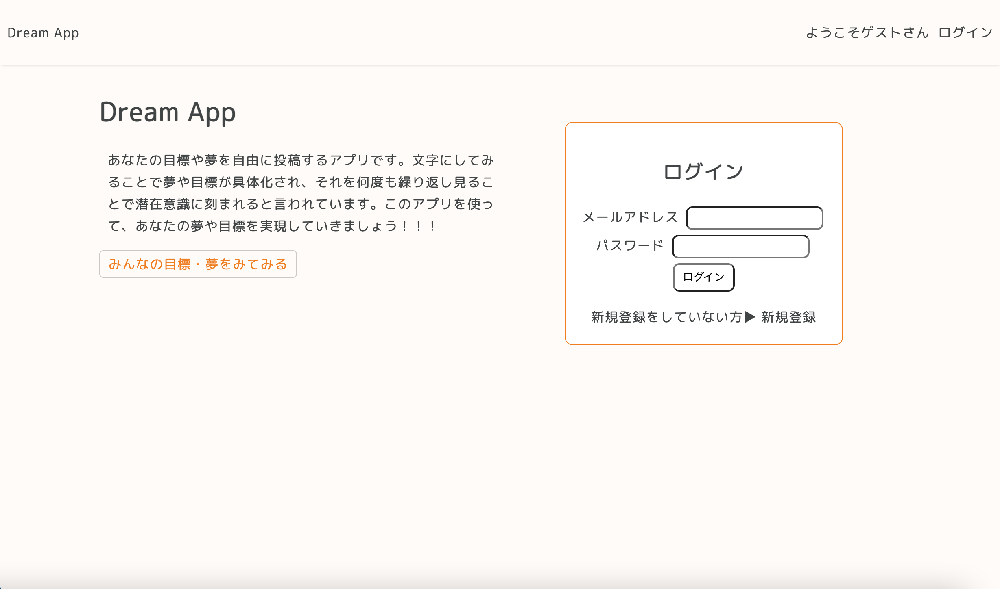
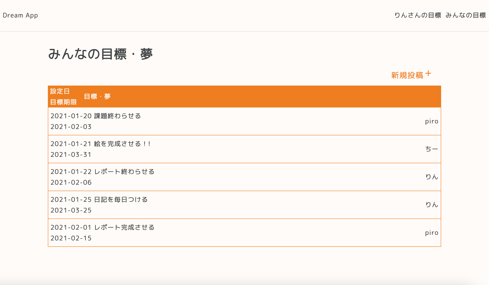
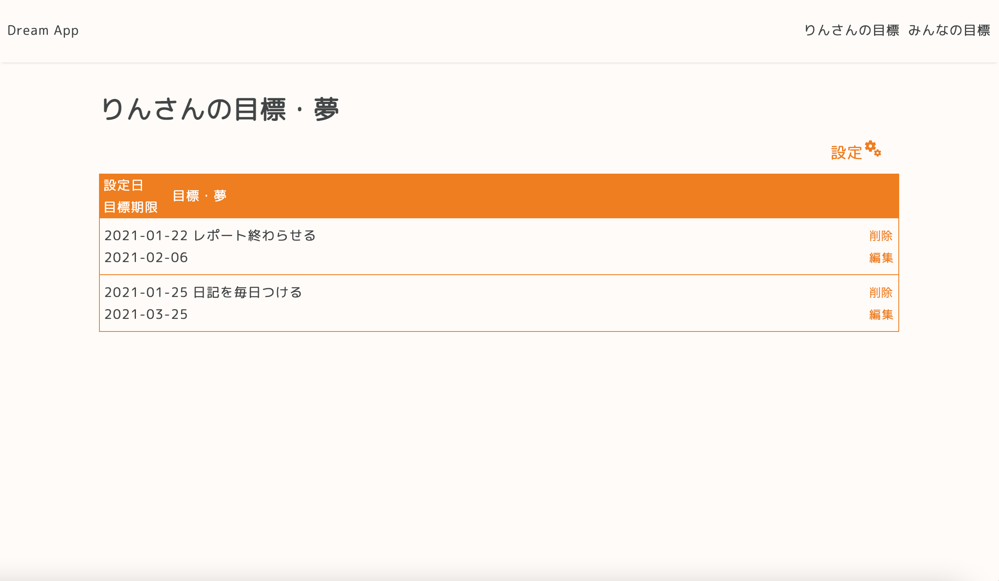
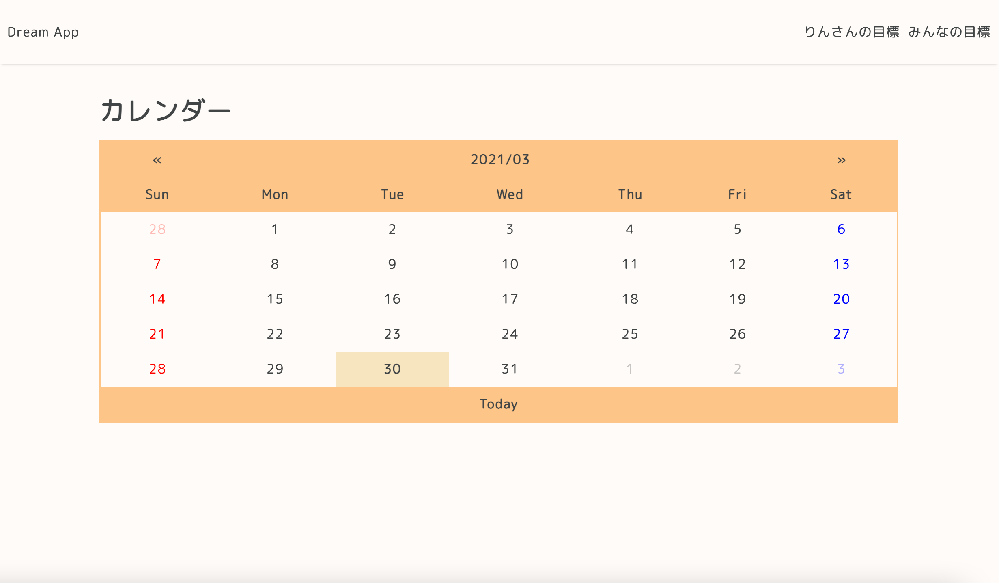

# Dream_App
## サービス概要
あなたの目標や夢を自由に投稿するWebアプリケーションです。  
文字にしてみることで夢や目標が具体化され、それを何度も繰り返し見ることで潜在意識に刻まれると言われています。  
ノートや日記に書くのも良いですが、みんなに目標を公表することでモチベーションがUPしたり、自分が何を目標にしているのかがよりわかりやすくなると考えたので作りました。  
このWebアプリケーションで夢や目標を共有し、あなたの夢や目標を実現させていきましょう！！！

## 作る上で意識した事
レスポンシブ対応のデザインになっているのでどんな画面サイズでも使いやすいようにしました。 
マイページで自分の目標一覧が表示されたり、空欄で投稿できないようにしたり、ユーザーが利用しやすいように考えました。   
メタタグを用いてSEO対策をしました。

## 開発環境
Node.js

## 各種機能＆導入技術
- データベース（MySQL）
- ユーザー登録、ログイン
- session管理（express-session）
- パスワードのハッシュ化（bcrypt）
- コードチェック（ESLint）

## トップページ

## 投稿一覧

## マイページ

## カレンダー
